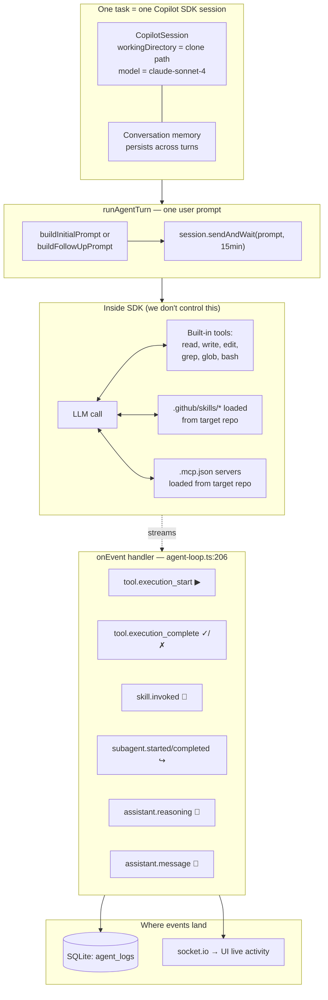
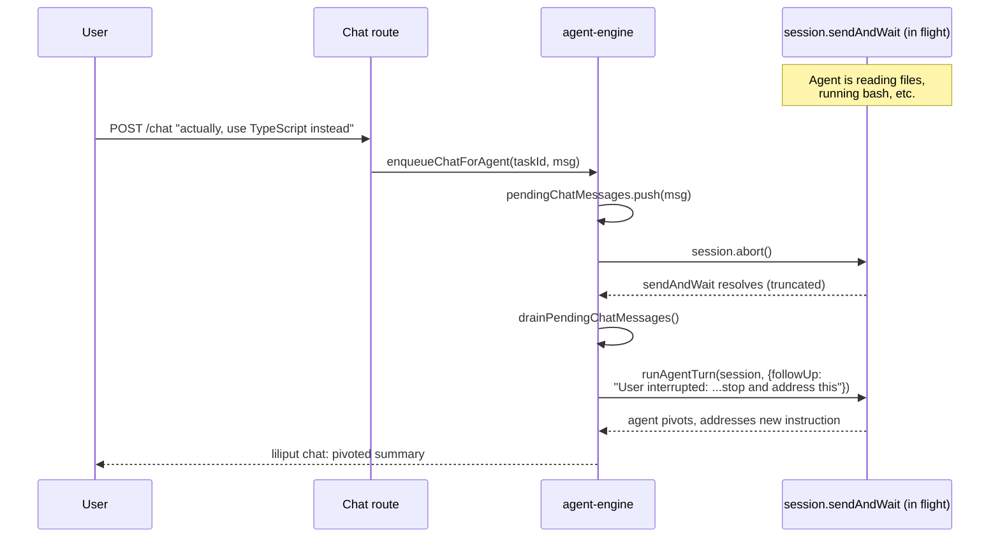
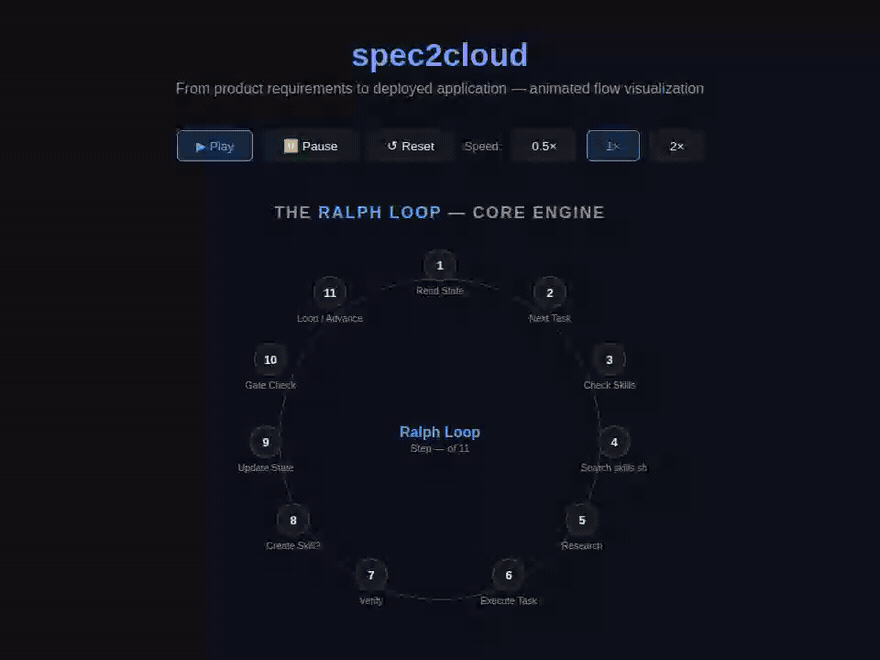

# spec2cloud · Next.js + TypeScript Shell

**Transform product specifications into production-ready applications on Azure — AI-powered, human-approved, spec-driven.**

spec2cloud is a spec-driven development framework where **specifications are the single source of truth**. Tests are generated from specs, implementation makes those tests pass, and the result is deployed to Azure — all orchestrated by an AI agent with **43 specialized skills**. Every step is resumable, auditable, and requires human approval before anything ships.

This is the **Next.js + TypeScript shell** — a pre-configured template with the full tech stack wired up and ready to go.

## How the Liliput Agent Works

Each "Liliputian" is a **single Copilot SDK session bound to a cloned target repo**. There is no LangChain, no custom tool runner, no JSON-blob plan parser — the SDK runs the agentic loop, and Liliput is a thin choreography layer (clone → SDK session → git/ACR/kubectl wrapping → preview URL).

### Lifecycle of one task

```mermaid
sequenceDiagram
    autonumber
    participant UI as Web (UI)
    participant API as Express API
    participant Eng as agent-engine
    participant Loop as agent-loop
    participant SDK as Copilot SDK
    participant FS as /data/workspaces/task-xxx
    participant Az as Azure (ACR/AKS)

    UI->>API: POST /api/tasks (title, desc, repo)
    API->>Eng: startBuild(taskId)
    Eng->>FS: git clone repo → cwd
    Eng->>Loop: createAgentSession(cwd)
    Loop->>SDK: client.createSession({model,<br/>workingDirectory: cwd,<br/>enableConfigDiscovery: true,<br/>onPermissionRequest: approveAll,<br/>onEvent: handler})
    SDK-->>Loop: CopilotSession (long-lived)
    Note over Loop,SDK: Session loads AGENTS.md,<br/>copilot-instructions.md,<br/>.mcp.json, .github/skills/<br/>from the cloned repo

    Eng->>Loop: runAgentTurn(session, {prompt, isInitial: true})
    Loop->>SDK: session.sendAndWait({prompt}, 15min)

    loop SDK internal agent loop
        SDK-->>Loop: assistant.reasoning (🧠 streamed)
        SDK->>FS: read / grep / glob / write / edit / bash
        SDK-->>Loop: tool.execution_start (▶ name+args)
        SDK-->>Loop: tool.execution_complete (✓/✗ + output)
        Loop-->>UI: socket.io "agent:tool-event"
    end

    SDK-->>Loop: final assistant.message (summary)
    Loop-->>Eng: {summary, toolCallCount}
    Eng->>FS: git status --porcelain → changed files
    Eng->>FS: git add/commit/push (via runGitOpWithFixer)
    Eng->>Az: az acr build → push image
    Eng->>Az: kubectl apply → dev preview
    Eng->>API: setTaskStatus("review")
    API-->>UI: socket.io "task:status"
```

### The four pieces inside the agent



### Mid-flight chat preemption

When a user sends a chat message while the agent is mid-turn, Liliput aborts the in-flight SDK call (preserving conversation memory) and runs a follow-up turn with the new instruction:



### Key code anchors

| Concept | File:Line |
|---|---|
| Session creation (the one SDK call that matters) | `agent-loop.ts:348` — `client.createSession({...})` |
| Single-turn LLM call | `agent-loop.ts:386` — `session.sendAndWait(...)` |
| Event → UI fan-out | `agent-loop.ts:206` — `makeEventHandler` |
| Conversation memory | `agent-loop.ts:355` — same `_session` reused across `runAgentTurn` calls |
| Multi-phase pipeline (architect/coder/builder/deployer/reviewer) | `agent-engine.ts` — all phases share **one** `agentSession` |
| Mid-flight preempt | `agent-loop.ts` — `abortAgentTurn` → `session.abort()` |

**Mental model:** the actual "agent intelligence" — deciding which files to read, what bash to run, when to write — is **100% inside `session.sendAndWait`**. Liliput just feeds it prompts and listens to its event stream.

## Why spec2cloud?

- **Specifications are the source of truth** — not code, not comments, not wikis
- **Tests before code** — every feature has tests before implementation begins
- **Human approval at every gate** — nothing ships without your sign-off
- **Resumable from any point** — state persisted in git, pick up where you left off
- **Works for new and existing apps** — greenfield builds new, brownfield modernizes existing
- **Live research** — agents query Microsoft Learn, Context7, and DeepWiki before writing a single line

## Two Paths, One Pipeline

**Greenfield** — Start with a product idea → PRD → FRD → UI prototypes → Tests → Contracts → Implementation → Deployed on Azure.

**Brownfield** — Start with existing code → Extract specs → Testability gate → Green baseline or behavioral docs → Assess → Plan → Same delivery pipeline.

Both converge on the same **Phase 2 delivery**: Tests → Contracts → Implementation → Deploy.

## How It Works

<p align="center">
  
</p>

> **[▶ Interactive version](docs/spec2cloud-flow.html)** — open in your browser for playback controls and speed adjustment.

Human approval gates pause the pipeline at every critical transition — nothing ships without your sign-off.

1. **Write a PRD** — plain-language product requirements in `specs/prd.md`
2. **Agents refine** — PRD → FRDs, reviewed through product + technical lenses
3. **Prototype** — interactive HTML wireframes you browse and approve in your browser
4. **Test-first** — Gherkin scenarios + Playwright e2e + Vitest unit tests, all failing (red baseline)
5. **Contracts** — API specs, shared TypeScript types, and infra requirements generated from specs
6. **Implement** — agents write code to make tests green (API slice → Web slice → Integration)
7. **Ship** — `azd up` deploys to Azure Container Apps; smoke tests verify production

## Quick Start

```bash
# Create your repo from this template
gh repo create my-app --template EmeaAppGbb/shell-typescript
cd my-app && npm install
cd src/web && npm install && cd ../..
cd src/api && npm install && cd ../..

# Run locally (Aspire recommended)
npm run dev:aspire        # API + Web + Docs with service discovery

# Write your PRD and let agents take over
code specs/prd.md

# Deploy to Azure
azd auth login && azd up
```

## This Shell's Tech Stack

| Layer | Technology |
|-------|-----------|
| Frontend | Next.js · TypeScript · App Router · Tailwind CSS |
| Backend | Express.js · TypeScript · Node.js |
| Testing | Playwright (e2e) · Cucumber.js (BDD) · Vitest + Supertest (unit) |
| Docs | MkDocs Material — auto-generated from wireframes + Gherkin + screenshots |
| Local orchestration | .NET Aspire (service discovery & dashboard) |
| Deployment | Azure Container Apps via Azure Developer CLI (`azd`) |
| AI research | Microsoft Learn · Context7 · DeepWiki · Azure Best Practices MCP |

## Key Commands

| Command | What it does |
|---------|-------------|
| `npm run dev:aspire` | Run all services with Aspire |
| `npm run dev:all` | API + Web + Docs concurrently |
| `npm run test:all` | Unit + BDD + e2e tests |
| `npm run build:all` | Production build (API + Web) |
| `npm run docs:full` | Capture screenshots + generate docs |
| `azd up` | Provision + deploy to Azure |

## Learn More

| Start Here | Then Explore | Go Deeper |
|-----------|-------------|-----------|
| [Quick Start](docs/quickstart.md) | [Greenfield Guide](docs/greenfield.md) | [Skills Catalog](docs/skills.md) |
| [Core Concepts](docs/concepts.md) | [Brownfield Guide](docs/brownfield.md) | [State & Gates](docs/state-and-gates.md) |
| [Microhack](docs/microhack.md) | [Examples](docs/examples/) | [Architecture](docs/architecture.md) |

## Extending

- **Skills** (`.github/skills/`) — 43 specialized agent procedures following the [agentskills.io](https://agentskills.io) standard
- **Orchestrator** (`AGENTS.md`) — the central loop; modify phases, gates, or add new ones
- **Other shells** — swap Next.js/Express for any framework; see [available shells](docs/shells.md)
- **Community skills** — discover and publish skills at [skills.sh](https://skills.sh/)

## Contributing

See [CONTRIBUTING.md](CONTRIBUTING.md) for guidelines. Please read our [Code of Conduct](CODE_OF_CONDUCT.md).

## Security

To report vulnerabilities, see [SECURITY.md](SECURITY.md).

## License

[ISC](LICENSE)

---

**From idea to production — spec-driven, AI-powered, human-approved.**
