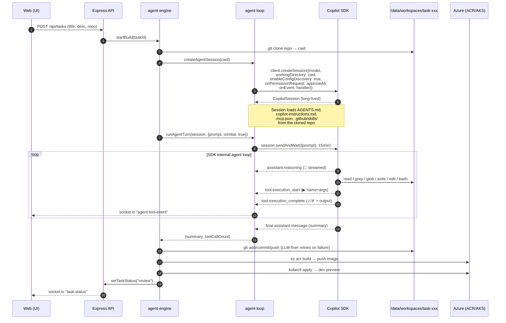
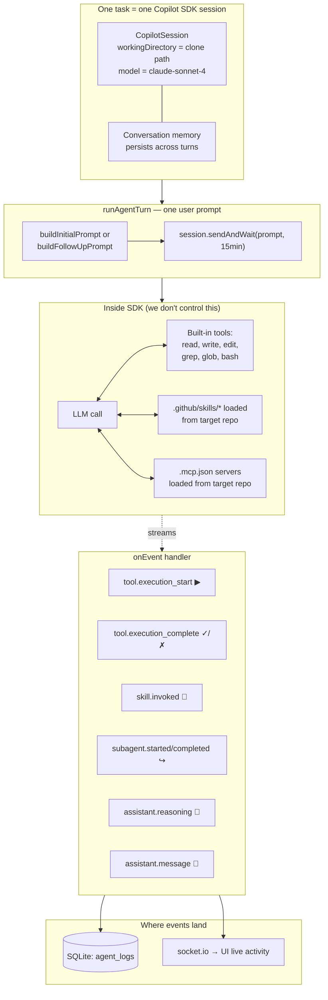
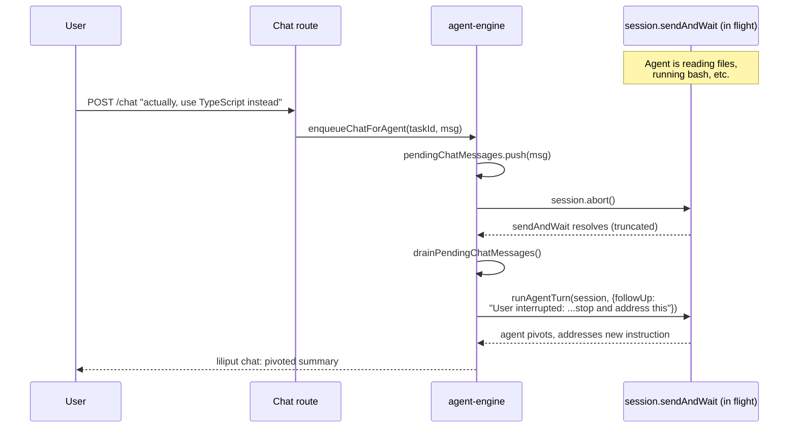
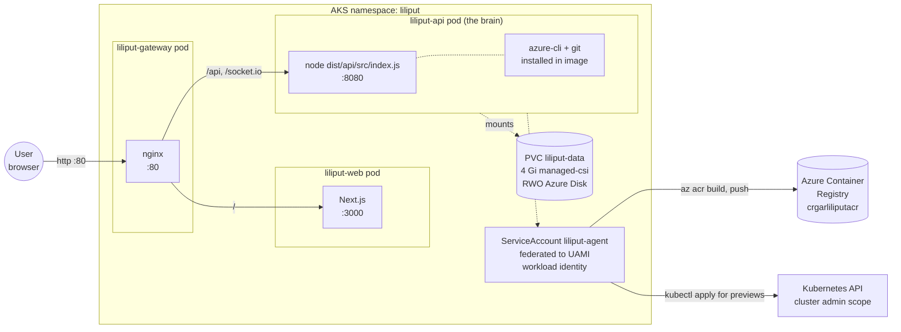
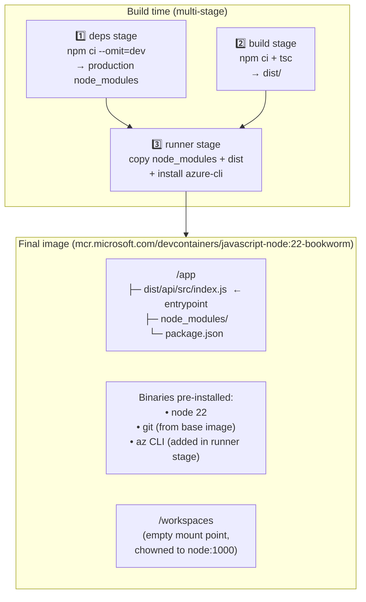
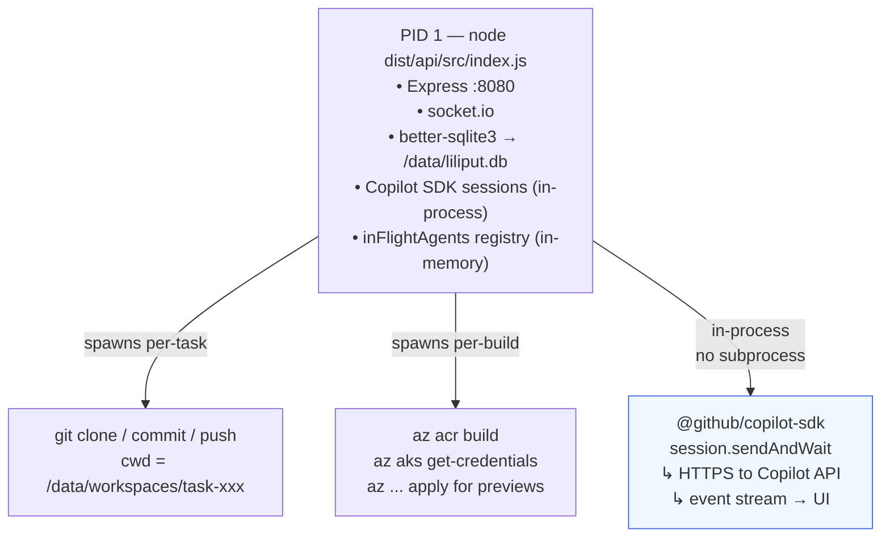

# Liliput

**Describe a software change in plain English. Liliput's agents — the "Liliputians" — clone your repo, write the code, build it, deploy a preview, and open a pull request. Watch every tool call live and steer the agent mid-flight by chatting.**

> Live: **http://4.165.50.135**

---

## What Liliput does

You give it a target GitHub repository and a task like:

> *"Add a dark-mode toggle to the React app."*
> *"Migrate the auth controller from callbacks to async/await."*
> *"Wire a /healthz endpoint and update the k8s probes."*

Liliput then, end-to-end:

1. **Clones** the target repo into an isolated workspace.
2. **Spawns a Liliputian** — a Copilot SDK agent session bound to that workspace.
3. **The Liliputian works the task** — reads files, edits code, runs the build, fixes its own errors. Everything streams to the UI.
4. **Commits to a branch**, pushes, and opens a **draft pull request**.
5. **Builds a container image** (Azure Container Registry) and **deploys a preview** to AKS so you can click a URL and try the change.
6. **Hands the task back to you for review.** You can chat with the Liliputian to ask for changes, and it iterates on the same branch + preview.

Each task lives in its own card on the dashboard with status (`specifying → building → deploying → review`), a streaming activity feed, the chat, the diff, the PR link, and the preview URL.

## How you use it

1. **Open the dashboard**, hit *New Task*.
2. **Pick the target repo** and write what you want.
3. **Watch the activity feed.** You'll see the agent's reasoning, the bash commands it runs, the files it reads and writes — in real time.
4. **Chat with the Liliputian at any time.** If you say something while it's working, it will **stop what it's doing**, read your message, and pivot. ("Actually, use TypeScript instead." → it abandons the JS path mid-edit and switches.)
5. **When it reaches `review`**, click the PR link, click the preview URL, try the change. If you want tweaks, send another chat message — the agent re-enters the loop, edits, re-deploys, and updates the PR.

Tasks are persistent (SQLite on a 4 Gi PVC), so the dashboard survives pod restarts.

---

## How a Liliputian works (under the hood)

Each Liliputian is **one Copilot SDK session bound to one cloned repo**. There's no custom planner, no JSON-blob tool runner — the SDK runs the agentic loop, and Liliput is a thin choreography layer around it (clone → SDK session → git/ACR/kubectl wrapping → preview URL).

### Lifecycle of one task



### What's actually inside a Liliputian



The **agent intelligence** — picking files, running bash, deciding when to write — is **100% inside `session.sendAndWait`**. Liliput just feeds prompts and listens to the stream.

### Skills: how Liliputians learn the target repo

When the SDK creates a session in the cloned repo, it discovers and loads:

- `AGENTS.md` — orchestrator instructions
- `.github/copilot-instructions.md` — coding conventions
- `.github/skills/*/SKILL.md` — specialized procedures (test generation, contract design, deployment, etc.)
- `.mcp.json` — MCP servers the agent can call

This means **a Liliputian working on `repo-A` follows `repo-A`'s rules**. Drop a new skill into the target repo and the next task picks it up automatically — no Liliput change required.

### Mid-flight chat preemption

When you send a chat message while the Liliputian is mid-turn, Liliput aborts the in-flight SDK call (preserving conversation memory) and runs a follow-up turn with your new instruction:



The agent's conversation memory is preserved — it knows what it was doing and why it pivoted.

### Self-healing: LLM-driven failure recovery

Liliputians don't blindly retry on errors. When `git push`, `az acr build`, or `kubectl apply` fail, Liliput hands the failure (command + stderr + working dir state) back to the SDK and asks it to **diagnose and fix**. The agent investigates — runs `git status`, inspects the manifest, looks at the registry — and proposes a mitigation, which Liliput executes. If the next attempt fails, the new error is fed back in. The same pattern applies to build errors and deployment failures.

### One pod, many Liliputians

The Liliput backend runs as a single pod on AKS. Multiple Liliputians can be in flight concurrently (each in its own SDK session, its own clone directory) — they're tracked in an in-memory `inFlightAgents` registry so chat preemption can find the right one. **If the pod restarts mid-task, in-flight Liliputians are lost** — the task stays in its last persisted status (`building`, etc.) and you'll need to retry it. SQLite + the workspace PVC mean dashboard state and any committed work survive the restart.

---

## Inside the container

Liliput on AKS is **three deployments + one PVC** under the `liliput` namespace, fronted by a single LoadBalancer:



The gateway and web pods are stateless and trivial. **All the interesting state lives in the API pod**, which is the only one with the PVC mounted.

### Image — what gets baked in

The API container is a 3-stage Dockerfile that produces a slim runtime image with everything a Liliputian needs to do its job:



**Why these tools?** Each one is something the agent runtime needs to invoke directly:

| Tool | Why it's in the image |
|---|---|
| `node` 22 | Runs the API + the Copilot SDK (the SDK is a Node library) |
| `git` | Cloning target repos, committing/pushing the agent's work |
| `az` CLI | `az acr build` to build container images for the agent's preview deployments |
| `kubectl` would be next | Currently invoked via `az aks` — pods authenticate via workload identity |

### Runtime — filesystem layout when the pod is running

When the API pod is running, it looks like this from the inside:

```
/                                    (read-only base image layers)
├── app/                              ← WORKDIR, owned by node:1000
│   ├── dist/api/src/index.js         ← entrypoint (CMD)
│   ├── node_modules/                 ← prod deps (incl. @github/copilot-sdk, better-sqlite3, …)
│   └── package.json
│
├── data/                             ← PVC mount (4 Gi, RWO Azure Disk, persistent)
│   ├── liliput.db                    ← SQLite — tasks, sessions, agent_logs, chat
│   └── workspaces/
│       ├── task-abc123/              ← per-task: clone of target repo
│       │   ├── .git/
│       │   ├── src/...               ← agent edits files here
│       │   └── ...
│       ├── task-def456/
│       └── …                          ← one directory per task; survives pod restart
│
├── home/node/.azure/                 ← emptyDir (NOT persisted)
│   └── …                              ← az CLI token cache, workload-identity stuff
│
└── workspaces/                       ← legacy mount point (now /data/workspaces is used)
```

Two volumes are attached:

- **`/data`** → `liliput-data` PVC (4 Gi managed-csi, ReadWriteOnce). The SQLite DB and every cloned repo live here. **This survives pod restarts** — that's why dashboard state and uncommitted agent work aren't lost when the deployment rolls.
- **`/home/node/.azure`** → `emptyDir` (lost on pod restart). Only holds the az CLI's token cache; the actual identity comes from workload-identity tokens injected by AKS, so a restart just re-fetches them.

### Process tree inside the API pod

It's deliberately simple — one Node process, with the agent runtime spawning short-lived `git` and `az` children as needed:



Important consequences:

- The Copilot SDK runs **in-process** with the API. It's not a subprocess and not a sidecar — it's a Node library call. That's why `inFlightAgents` is just a `Map<taskId, session>` in memory, and why a pod restart kills every in-flight Liliputian instantly.
- `git` and `az` are subprocesses. The agent's `bash` tool calls (`session.sendAndWait` → SDK runs `bash`) are also subprocesses spawned by the SDK in the cloned repo's working directory.
- The pod requests very little CPU (10m) but is allowed to burst to 1 CPU / 1 Gi RAM during a build. Most of the time it's idle waiting on the Copilot API.

### Identity and what it can do

The pod runs under the `liliput-agent` ServiceAccount, federated to an Azure UAMI via workload identity. That identity:

| Action | How it's authorized |
|---|---|
| `az acr build` / push to `crgarliliputacr` | UAMI has `AcrPush` on the registry |
| `kubectl apply` for preview deployments | ClusterRole `liliput-agent` (manage namespaces / deployments / services / configmaps / secrets / pods) |
| `git clone` / `git push` / open PRs | `COPILOT_GITHUB_TOKEN` from the `liliput-secrets` Secret |
| Copilot SDK API calls | Same `COPILOT_GITHUB_TOKEN` (the SDK reads it from env) |

There is intentionally **no separate "agent identity"** — the API pod *is* the agent runtime, so giving the pod the right RBAC is the same as giving each Liliputian the right RBAC.

---

## Liliput CLI

A k9s-style terminal UI for Liliput. Browse tasks, watch agent activity in real time, chat with running tasks, ship or discard reviews — all from the terminal.

### Install

**Windows (recommended) — install via [Scoop](https://scoop.sh):**

```powershell
scoop bucket add liliput https://github.com/crgarcia12/Liliput
scoop install liliput
liliput
```

Upgrades: `scoop update liliput`. The bucket auto-updates on every CLI release.

**Windows (manual):**
1. Download `liliput-windows-amd64.exe` from the latest [release](https://github.com/crgarcia12/Liliput/releases?q=cli-v).
2. Rename to `liliput.exe` and place it on your PATH (e.g., `C:\Tools\liliput.exe`).
3. Run `liliput.exe` from any PowerShell or CMD window.

**macOS / Linux:**
Download the matching binary, `chmod +x`, and move to a directory on your PATH.

**From source (any platform with Go 1.22+):**
```bash
cd cli
go build -o liliput ./cmd/liliput
```

### Usage

```bash
# Connect to the default hosted backend
liliput

# Or point at a different deployment
liliput --server http://localhost:5001
# (or set LILIPUT_API_URL=http://localhost:5001)
```

### Keybindings

| Key | Action |
|-----|--------|
| `↑`/`↓` or `j`/`k` | Navigate rows |
| `Enter` | Open task |
| `n` | New task |
| `d` | Delete task |
| `s` | Ship task (when in review) |
| `x` | Discard task (when in review) |
| `/` | Filter |
| `?` | Help |
| `q` | Quit / back |
| `Tab` | Cycle pane focus (in task detail) |
| `i` | Focus chat input |
| `Esc` | Leave input / close modal |
| `o` | Open dev URL in browser |
| `l` | View dev pod logs |

See [`cli/README.md`](cli/README.md) for development details.

### Releases

Releases are automated. Push a tag matching `cli-v*` (e.g., `cli-v0.1.0`) and GitHub Actions builds + publishes binaries for Windows, Linux, and macOS.

---

## License

[ISC](LICENSE)
