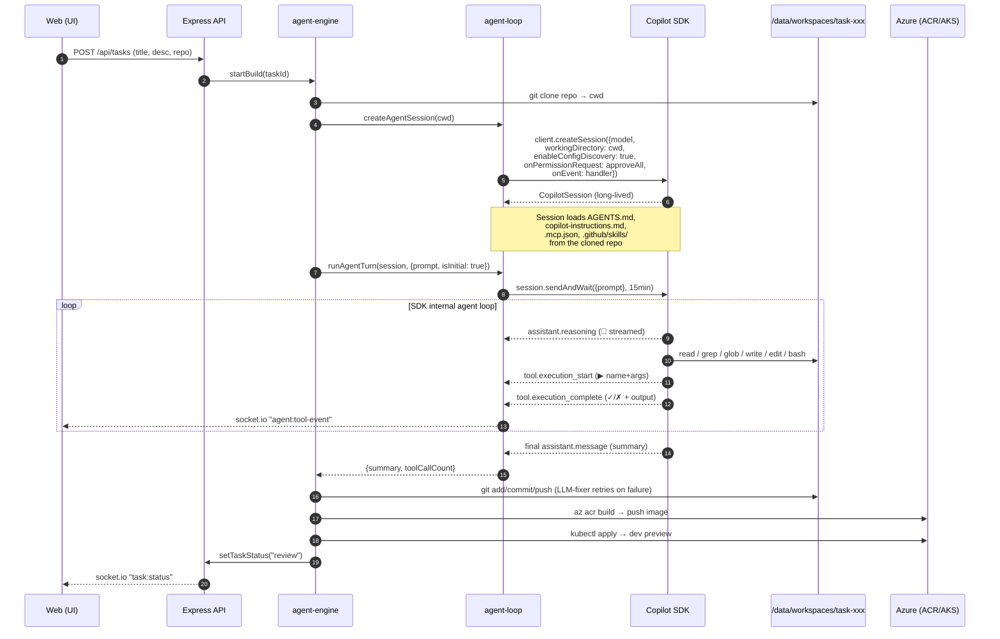
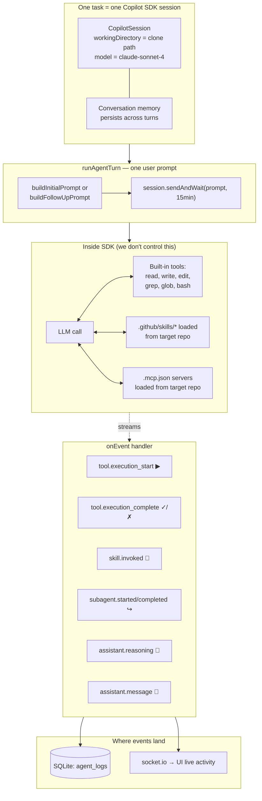
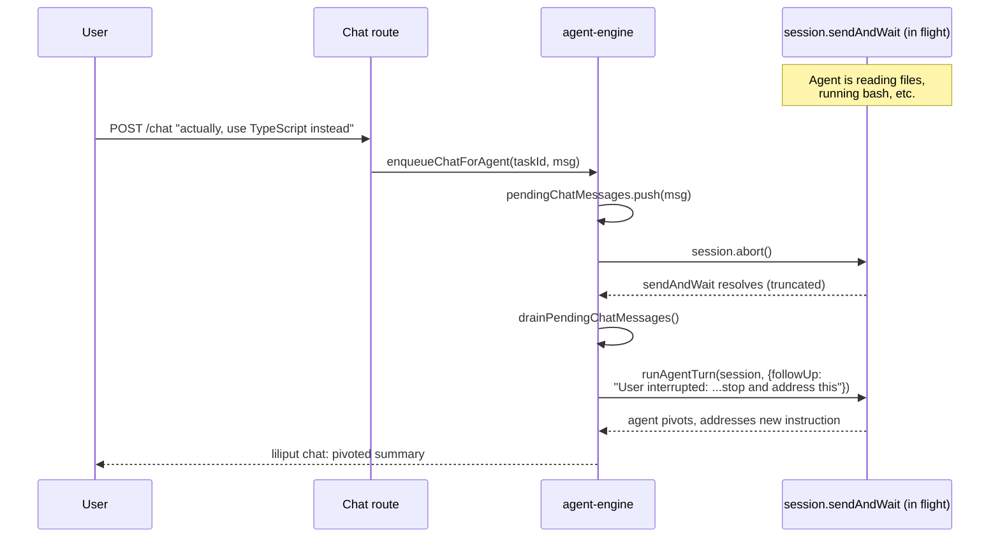

# Liliput

**Describe a software change in plain English. Liliput's agents — the "Liliputians" — clone your repo, write the code, build it, deploy a preview, and open a pull request. Watch every tool call live and steer the agent mid-flight by chatting.**

> Live: **http://4.165.50.135**

---

## What Liliput does

You give it a target GitHub repository and a task like:

> *"Add a dark-mode toggle to the React app."*
> *"Migrate the auth controller from callbacks to async/await."*
> *"Wire a /healthz endpoint and update the k8s probes."*

Liliput then, end-to-end:

1. **Clones** the target repo into an isolated workspace.
2. **Spawns a Liliputian** — a Copilot SDK agent session bound to that workspace.
3. **The Liliputian works the task** — reads files, edits code, runs the build, fixes its own errors. Everything streams to the UI.
4. **Commits to a branch**, pushes, and opens a **draft pull request**.
5. **Builds a container image** (Azure Container Registry) and **deploys a preview** to AKS so you can click a URL and try the change.
6. **Hands the task back to you for review.** You can chat with the Liliputian to ask for changes, and it iterates on the same branch + preview.

Each task lives in its own card on the dashboard with status (`specifying → building → deploying → review`), a streaming activity feed, the chat, the diff, the PR link, and the preview URL.

## How you use it

1. **Open the dashboard**, hit *New Task*.
2. **Pick the target repo** and write what you want.
3. **Watch the activity feed.** You'll see the agent's reasoning, the bash commands it runs, the files it reads and writes — in real time.
4. **Chat with the Liliputian at any time.** If you say something while it's working, it will **stop what it's doing**, read your message, and pivot. ("Actually, use TypeScript instead." → it abandons the JS path mid-edit and switches.)
5. **When it reaches `review`**, click the PR link, click the preview URL, try the change. If you want tweaks, send another chat message — the agent re-enters the loop, edits, re-deploys, and updates the PR.

Tasks are persistent (SQLite on a 4 Gi PVC), so the dashboard survives pod restarts.

---

## How a Liliputian works (under the hood)

Each Liliputian is **one Copilot SDK session bound to one cloned repo**. There's no custom planner, no JSON-blob tool runner — the SDK runs the agentic loop, and Liliput is a thin choreography layer around it (clone → SDK session → git/ACR/kubectl wrapping → preview URL).

### Lifecycle of one task

### What's actually inside a Liliputian

The **agent intelligence** — picking files, running bash, deciding when to write — is **100% inside `session.sendAndWait`**. Liliput just feeds prompts and listens to the stream.

### Skills: how Liliputians learn the target repo

When the SDK creates a session in the cloned repo, it discovers and loads:

- `AGENTS.md` — orchestrator instructions
- `.github/copilot-instructions.md` — coding conventions
- `.github/skills/*/SKILL.md` — specialized procedures (test generation, contract design, deployment, etc.)
- `.mcp.json` — MCP servers the agent can call

This means **a Liliputian working on `repo-A` follows `repo-A`'s rules**. Drop a new skill into the target repo and the next task picks it up automatically — no Liliput change required.

### Mid-flight chat preemption

When you send a chat message while the Liliputian is mid-turn, Liliput aborts the in-flight SDK call (preserving conversation memory) and runs a follow-up turn with your new instruction:

The agent's conversation memory is preserved — it knows what it was doing and why it pivoted.

### Self-healing: LLM-driven failure recovery

Liliputians don't blindly retry on errors. When `git push`, `az acr build`, or `kubectl apply` fail, Liliput hands the failure (command + stderr + working dir state) back to the SDK and asks it to **diagnose and fix**. The agent investigates — runs `git status`, inspects the manifest, looks at the registry — and proposes a mitigation, which Liliput executes. If the next attempt fails, the new error is fed back in. The same pattern applies to build errors and deployment failures.

### One pod, many Liliputians

The Liliput backend runs as a single pod on AKS. Multiple Liliputians can be in flight concurrently (each in its own SDK session, its own clone directory) — they're tracked in an in-memory `inFlightAgents` registry so chat preemption can find the right one. **If the pod restarts mid-task, in-flight Liliputians are lost** — the task stays in its last persisted status (`building`, etc.) and you'll need to retry it. SQLite + the workspace PVC mean dashboard state and any committed work survive the restart.

---

## License

[ISC](LICENSE)
