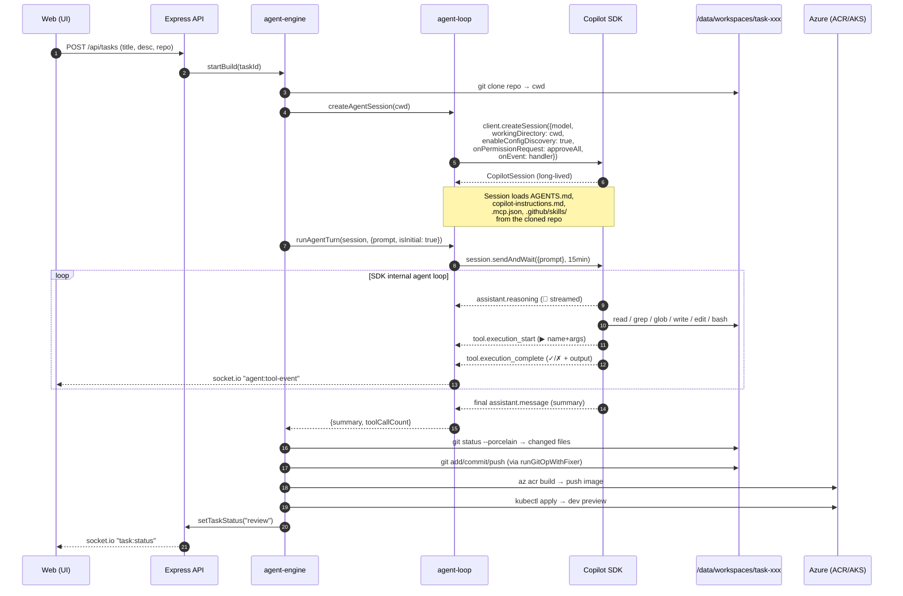
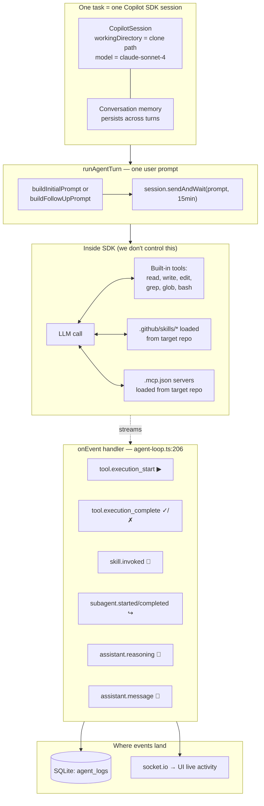
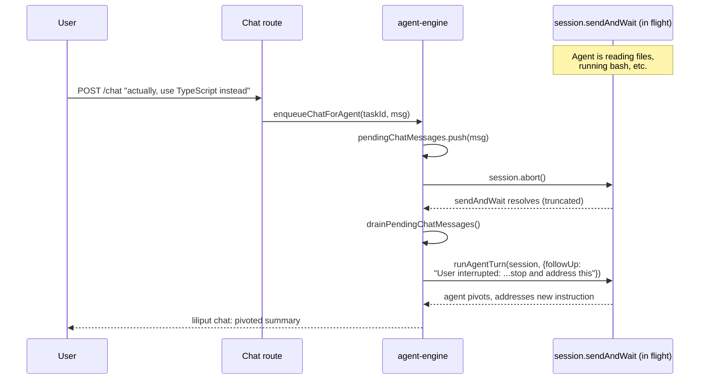

# Liliput

**A meta-app that orchestrates Copilot SDK agents — "Liliputians" — to build, deploy, and iterate on real GitHub repositories from natural-language tasks.**

You describe what you want (e.g. *"add a dark-mode toggle to the React app"*), Liliput clones the target repo, spawns a chain of Copilot SDK agents (architect → coder → builder → deployer → reviewer), commits the work to a branch, builds a container image with `az acr build`, deploys a preview to AKS, and opens a draft pull request — all visible live in the web UI with streaming tool calls and chat-based iteration.

| | |
|---|---|
| **Live URL** | http://4.165.50.135 |
| **Deployment** | AKS (`crgar-liliput-aks`) — single pod, SQLite on a 4 Gi PVC |
| **CI/CD** | GitHub Actions → Azure Container Registry → `kubectl apply` |
| **Stack** | Express.js + Next.js + socket.io + `@github/copilot-sdk` + SQLite |

## How the Liliput Agent Works

Each "Liliputian" is a **single Copilot SDK session bound to a cloned target repo**. There is no LangChain, no custom tool runner, no JSON-blob plan parser — the SDK runs the agentic loop, and Liliput is a thin choreography layer (clone → SDK session → git/ACR/kubectl wrapping → preview URL).

### Lifecycle of one task



### The four pieces inside the agent



### Mid-flight chat preemption

When a user sends a chat message while the agent is mid-turn, Liliput aborts the in-flight SDK call (preserving conversation memory) and runs a follow-up turn with the new instruction:



### Key code anchors

| Concept | File |
|---|---|
| Session creation (the one SDK call that matters) | `src/api/src/engine/agent-loop.ts` — `client.createSession({...})` |
| Single-turn LLM call | `src/api/src/engine/agent-loop.ts` — `session.sendAndWait(...)` |
| Event → UI fan-out | `src/api/src/engine/agent-loop.ts` — `makeEventHandler` |
| Multi-phase pipeline (architect/coder/builder/deployer/reviewer) | `src/api/src/engine/agent-engine.ts` — all phases share **one** `agentSession` |
| Mid-flight preempt | `src/api/src/engine/agent-loop.ts` — `abortAgentTurn` → `session.abort()` |
| Git failure recovery (LLM-driven) | `src/api/src/engine/git-fixer.ts` |
| Build/deploy failure recovery (LLM-driven) | `src/api/src/engine/ops-fixer.ts` |

**Mental model:** the actual "agent intelligence" — deciding which files to read, what bash to run, when to write — is **100% inside `session.sendAndWait`**. Liliput just feeds it prompts and listens to its event stream.

## Repository Layout

```
src/api/          Express.js backend — task store, agent engine, SDK orchestration
src/web/          Next.js frontend — task dashboard, live activity, chat
src/shared/       TypeScript types shared between API and Web
k8s/              Kubernetes manifests (Deployment, Service, Ingress, PVC)
infra/            Bicep templates for the AKS cluster + ACR
.github/skills/   Agent skills (agentskills.io standard) — loaded by the SDK
AGENTS.md         Orchestrator instructions for skill-aware agents
```

## Local Development

Liliput needs a Copilot subscription with API access (the SDK uses your `gh` CLI auth) and Docker for the dev container.

```bash
# Backend
cd src/api && npm install && npm run dev   # http://localhost:5001

# Frontend
cd src/web && npm install && npm run dev   # http://localhost:3000
```

The frontend talks to the backend via socket.io for live activity. SQLite lives at `/data/liliput.db` in the container; locally it falls back to `./liliput.db`.

## Deployment

```bash
# Build + push image (manual)
az acr build -r crgarliliputacr -t liliput-api:latest -f src/api/Dockerfile src/api

# Apply manifests
kubectl apply -f k8s/

# CI/CD
git push origin main   # triggers .github/workflows/deploy-liliput.yml
```

## License

[ISC](LICENSE)
