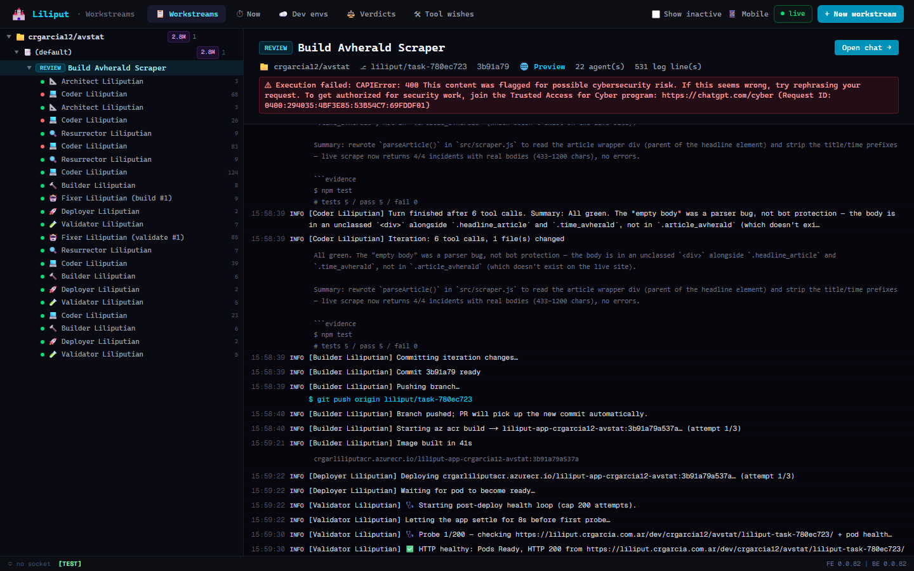
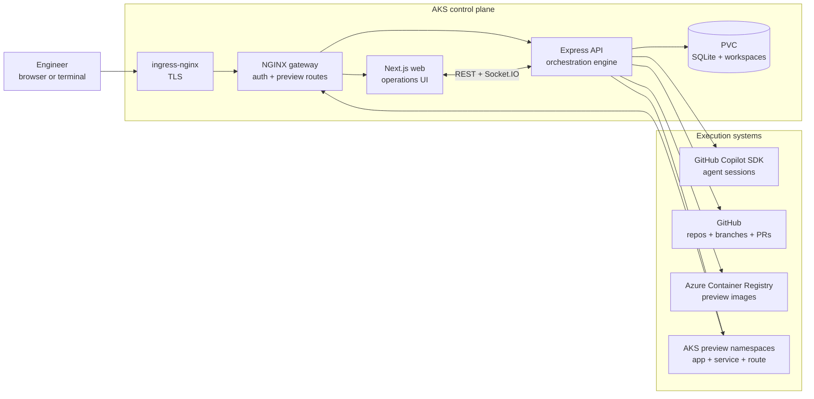

# Liliput

<p align="center">
  <strong>An observable software factory for GitHub repositories.</strong><br/>
  Intent becomes an isolated agent run, tested code, a live AKS preview, review evidence, and a pull request.
</p>

<p align="center">
  
</p>

<p align="center">
  <a href="https://liliput.crgarcia.com.ar">Live system</a>
  &nbsp;&middot;&nbsp;
  <a href="cli/README.md">Terminal client</a>
  &nbsp;&middot;&nbsp;
  <a href="#runtime-architecture">Architecture</a>
  &nbsp;&middot;&nbsp;
  <a href="CONTRIBUTING.md">Contributing</a>
</p>

<p align="center">
  <a href="https://github.com/crgarcia12/Liliput/actions/workflows/ci.yml"></a>
  <a href="LICENSE"></a>
</p>

Most coding agents optimize for producing a diff. Liliput optimizes for
producing an **auditable delivery**.

It is a Next.js and Express control plane around GitHub Copilot SDK sessions.
Each task gets a cloned repository workspace, repo-owned instructions and
skills, a live execution trace, quality gates, an optional AKS preview, and a
human release decision.

> The unit of work is not a model response. It is a repository state transition
> backed by evidence.

## At a glance

| Concern | Liliput's contract |
| --- | --- |
| Input | A plain-language outcome and a target GitHub repository |
| Isolation | A cloned workspace per task on persistent storage |
| Context | Instructions, skills, and MCP configuration discovered from the target repo |
| Execution | Copilot SDK agent turns that can search, edit, run commands, test, commit, and push |
| Evidence | Tool calls, logs, model usage, test output, deploy health, and reviewer verdicts |
| Output | A branch, a live preview when configured, and a pull request ready for human judgment |
| Control | Observe, interrupt, redirect, retry, ship, or discard from the web UI or terminal |

## The control plane is the product

<p align="center">
  
</p>

<p align="center">
  <sub>A real task trace, not a staged happy path: a model refusal is visible, the next iteration recovers, tests pass, an image is built, AKS rolls it out, and the preview reaches HTTP 200.</sub>
</p>

Liliput keeps the engineering process visible instead of collapsing it into a
success-shaped answer. The operator can inspect which agent acted, which tools
ran, what failed, how the next iteration responded, and what evidence supports
the final result.

## How one task moves through the system

1. **Create a task.** Select a repository, describe the outcome, and choose the
   coding and reviewer models.
2. **Enter an isolated workspace.** Liliput clones the repository and creates a
   task branch without sharing mutable source state with another task.
3. **Load repository-owned context.** The agent discovers project instructions,
   local skills, deployment contracts, and MCP servers from the clone.
4. **Run an evidence-producing loop.** The agent searches, edits, executes
   commands, writes or updates tests, and records each event.
5. **Build and prove the result.** Liliput can push the branch, build an image in
   ACR, deploy a namespace-scoped AKS preview, probe it, and feed failures back
   into the next iteration.
6. **Apply review gates.** Reviewer agents inspect the implementation and its
   evidence before the task reaches a release decision.
7. **Return control to the engineer.** Ship the pull request, redirect the task,
   retry a failed stage, or discard the work.

## What is implemented

| System | Implementation |
| --- | --- |
| Task orchestration | Persistent workstreams, tasks, turns, statuses, retries, and human actions |
| Agent runtime | In-process Copilot SDK sessions with role-specific model and reasoning settings |
| Repository context | Automatic discovery of repo instructions, agentskills.io skills, and MCP servers |
| Live evidence | Socket.IO event streaming for messages, tools, logs, usage, and state transitions |
| Quality loops | Project tests, Cucumber, Playwright, critic/reviewer turns, health probes, and verdicts |
| Git delivery | Isolated branches, commits, pushes, pull requests, and a per-iteration conflict guard |
| Preview runtime | ACR image builds plus Kubernetes Deployment, Service, routing, logs, and health checks |
| Azure identity | Repo-scoped Entra service principals and credential projection for AI-enabled previews |
| Control surfaces | Next.js operations UI and a Go/Bubble Tea terminal client |
| Durable team loop | Optional PM -> Dev -> Release Manager state carried by GitHub issues, labels, and PRs |

## Engineering principles

### Observable autonomy

Agents may iterate independently, but tool calls, failures, model selection,
usage, test output, deployment state, and review decisions remain inspectable.

### The repository owns the context

Liliput does not rely on one global prompt. Each cloned target repository can
teach the agent through its own instructions, skills, tests, contracts, and MCP
configuration.

### Evidence outranks narration

A confident summary is not a release gate. Tests, commits, image digests,
rollout state, HTTP probes, diffs, and reviewer verdicts are.

### Human control stays in the loop

Operators can interrupt a running task, add direction, inspect the preview,
ship the branch, or discard it. Feature decomposition and multi-feature fan-out
are operator-controlled by default, not silently automatic.

## Runtime architecture


```mermaid
flowchart LR
    Operator["Engineer<br/>browser or terminal"]

    subgraph AKS["AKS control plane"]
        Ingress["ingress-nginx<br/>TLS"]
        Gateway["NGINX gateway<br/>auth + preview routes"]
        Web["Next.js web<br/>operations UI"]
        API["Express API<br/>orchestration engine"]
        State[("PVC<br/>SQLite + workspaces")]
    end

    subgraph Execution["Execution systems"]
        SDK["GitHub Copilot SDK<br/>agent sessions"]
        GitHub["GitHub<br/>repos + branches + PRs"]
        ACR["Azure Container Registry<br/>preview images"]
        Preview["AKS preview namespaces<br/>app + service + route"]
    end

    Operator --> Ingress --> Gateway
    Gateway --> Web
    Gateway --> API
    Web <-->|"REST + Socket.IO"| API
    API --> State
    API --> SDK
    API --> GitHub
    API --> ACR
    API --> Preview
    Preview --> Gateway
```

The API pod is currently the single-writer brain. It owns task coordination,
Copilot SDK sessions, Git operations, image builds, Kubernetes deployment, and
live event publication. SQLite and cloned workspaces survive on the persistent
volume. An API pod restart interrupts an active in-process SDK turn, while its
durable task and repository state remain available for recovery.

## Repository layout

```text
.
|-- src/
|   |-- api/       Express API, agent engine, stores, auth, Git, Azure, and Kubernetes
|   |-- web/       Next.js control plane, task views, previews, and live activity
|   `-- shared/    TypeScript contracts shared by API and Web
|-- cli/           Go/Bubble Tea terminal client
|-- e2e/           Playwright end-to-end tests and page objects
|-- tests/         Cucumber feature tests
|-- k8s/           AKS manifests for gateway, API, Web, storage, and ingress
|-- infra/         Azure infrastructure templates and deployment scripts
|-- templates/     Target-repo overlay for the durable PM -> Dev -> RM loop
|-- specs/         Product, feature, architecture, and delivery specifications
`-- .github/
    |-- workflows/ CI, releases, token rotation, and AKS deployment
    `-- skills/    Agent procedures discovered by Copilot SDK sessions
```

## Run locally

### Prerequisites

| Requirement | Needed for |
| --- | --- |
| Node.js 22 and npm | API, web UI, and test tooling |
| GitHub token with Copilot access | Real agent runs, Git operations, and pull requests |
| Go | Optional terminal client |
| Azure CLI and `kubectl` | Optional ACR builds and AKS preview deployments |

### Install

```powershell
git clone https://github.com/crgarcia12/Liliput.git
Set-Location Liliput

npm ci
npm --prefix src/api ci
npm --prefix src/web ci
```

### Start the control plane

```powershell
# Local values only. Never commit real secrets.
$env:JWT_SECRET = "replace-with-a-long-local-secret"
$env:DEFAULT_ADMIN_PASSWORD = "replace-with-a-local-password"
$env:COPILOT_GITHUB_TOKEN = "github-token-for-real-agent-runs"

npm run dev:all
```

| Surface | URL |
| --- | --- |
| Landing page | `http://localhost:3000/` |
| Dashboard | `http://localhost:3000/dashboard` |
| API health | `http://localhost:5001/api/health` |

The first boot seeds an `admin` user. If `DEFAULT_ADMIN_PASSWORD` is absent,
Liliput generates a password and prints it once. Existing SQLite databases keep
their users; changing the environment variable does not reset a stored
password.

## Terminal client

Install the Windows CLI through the repository's Scoop bucket:

```powershell
scoop bucket add liliput https://github.com/crgarcia12/Liliput
scoop install liliput
liliput --server http://localhost:5001 --login
```

The TUI exposes the same task list, live activity, chat, preview, ship, discard,
and pod-log operations as the web control plane. See
[`cli/README.md`](cli/README.md) for build instructions and keybindings.

## Development commands

| Command | Purpose |
| --- | --- |
| `npm run dev:all` | Run API and Web together |
| `npm run build:all` | Build API and Web |
| `npm run test:api` | Run the API Vitest suite |
| `npm run test:cucumber` | Run Cucumber features |
| `npm run test:e2e` | Run Playwright end-to-end tests |
| `npm run test:all` | Run API, Cucumber, and Playwright suites |
| `npm --prefix src/api run lint` | Lint the API |
| `npm --prefix src/web run lint` | Lint the Web app |
| `go test ./...` from `cli/` | Run CLI tests |

## Configuration

Never commit real values. Keep them in local environment variables, Kubernetes
Secrets, or GitHub Actions secrets.

| Variable | Purpose |
| --- | --- |
| `JWT_SECRET` | Signs Liliput sessions; keep stable across restarts |
| `DEFAULT_ADMIN_PASSWORD` | Seeds the first admin user for a new database |
| `DB_PATH` | SQLite database path |
| `COPILOT_GITHUB_TOKEN` | Primary token for Copilot-backed work and GitHub operations |
| `GH_TOKEN`, `GITHUB_TOKEN` | Fallback GitHub token names |
| `COPILOT_MODEL` | Default coding model |
| `COPILOT_REVIEWER_MODEL` | Default reviewer model |
| `COPILOT_<ROLE>_MODEL` | Optional role override for rewriter, architect, critic, coder, or reviewer |
| `ACR_NAME` | Azure Container Registry used for preview images |
| `LILIPUT_PUBLIC_URL` | Public base URL used for webhooks and navigation |
| `LILIPUT_NAMESPACE` | Kubernetes namespace used by the control plane |
| `LILIPUT_AI_FOUNDRY_SCOPE` | Azure scope used when provisioning repo-specific AI credentials |
| `LILIPUT_RECONCILER_ENABLED` | Enables issue and PR polling fallback when set to `1` |
| `LILIPUT_PM_EMIT_ENABLED` | Enables PM issue emission when set to `1` |
| `AUTOPILOT_DECOMPOSE` | Enables automatic workstream decomposition when explicitly configured |

Automatic feature fan-out, PM issue emission, and the polling reconciler are
disabled by default. This keeps work slicing and concurrency under operator
control.

## Production deployment

Production deployment is defined in
[`.github/workflows/deploy-liliput.yml`](.github/workflows/deploy-liliput.yml).
A push to `main` that changes application or Kubernetes files:

1. authenticates to Azure with GitHub OIDC;
2. builds SHA-tagged API and Web images in ACR;
3. renders and applies the Kubernetes manifests;
4. updates only the affected deployments; and
5. waits for API, Web, and gateway rollouts.

Useful operator checks:

```powershell
kubectl -n liliput get pods
kubectl -n liliput rollout status deployment/liliput-api
kubectl -n liliput logs deployment/liliput-api --tail=100
```

## Durable PM -> Dev -> RM loop

Liliput can install an optional agent workflow into a target repository. Its
state lives in GitHub issues, labels, PRs, and timelines instead of one chat
session.

```text
pm:ready
   |
   v
dev:in-progress
   |
   v
rm:review --------> done
   |
   v
rm:changes-requested
   |
   `-------------> dev:in-progress
```

Install the overlay:

```powershell
bash scripts/bootstrap-liliput-flow.sh <target-repo-path> --apply-labels
```

The PM agent writes a bounded issue with acceptance criteria. The Dev agent
implements it test-first and opens a pull request. The Release Manager runs a
deterministic checklist and either merges the change or returns structured
feedback. Operators choose feature boundaries; Liliput does not fan out a
product request into concurrent features by default.

## Operational notes

- Preview deployment requires working Azure, ACR, AKS, DNS, and ingress
  configuration; local control-plane development does not.
- Real agent work requires a valid GitHub token with Copilot access.
- The API uses SQLite and one active writer. Horizontal API scaling requires a
  different state and coordination model.
- Active SDK turns are in process. Persisted task state and workspaces survive
  restarts, but an interrupted turn must be resumed or retried.
- Secrets belong in environment variables, Kubernetes Secrets, or GitHub
  Actions secrets, never in source control.

## Contributing

Focused issues and pull requests are welcome. Start with
[`CONTRIBUTING.md`](CONTRIBUTING.md), keep changes covered by the existing test
layers, and preserve the evidence-first execution model.

## License

ISC. See [`LICENSE`](LICENSE).
