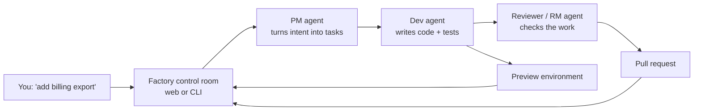
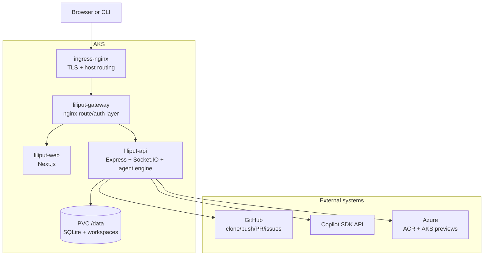
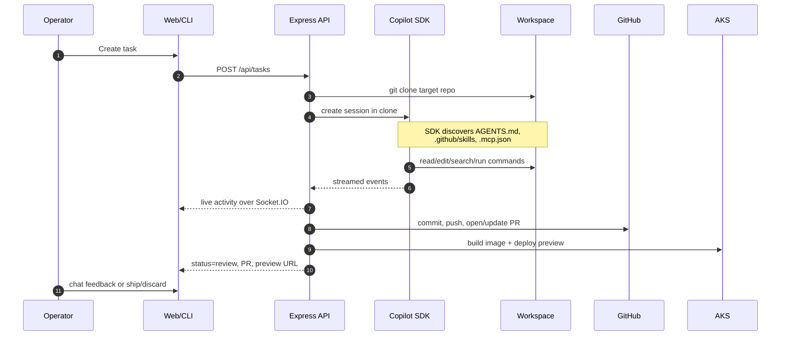

# Liliput

**Liliput is a tiny software civilization.** Inside it, specialized agents run
an end-to-end software development factory: they turn product intent into
tasks, clone repositories, understand local instructions, write code, test it,
review it, deploy previews, iterate on failures, and prepare pull requests for
humans to ship. A Liliputian is not just a chatbot with a file editor; it is a
worker in a miniature engineering world where planning, implementation,
verification, release management, and operational feedback all happen in one
observable loop.

Describe the application you want, the bug you need fixed, or the change you
want shipped. Liliput can coordinate the work from idea to running software,
including tests and preview deployments, while you watch the factory floor in
real time.


```mermaid
flowchart LR
    Idea["You: 'add billing export'"]
    Portal["Factory control room<br/>web or CLI"]
    PM["PM agent<br/>turns intent into tasks"]
    Dev["Dev agent<br/>writes code + tests"]
    Reviewer["Reviewer / RM agent<br/>checks the work"]
    Preview["Preview environment"]
    PR["Pull request"]

    Idea --> Portal --> PM --> Dev --> Reviewer
    Dev --> Preview
    Reviewer --> PR
    Preview --> Portal
    PR --> Portal
```

The wow factor is the factory: every agent turn is observable, every tool call
is streamed, every model setting is captured, every test or deployment failure
can feed the next iteration, and every task leaves an auditable trail from
request to review.

## The 60-second product tour

1. Open the portal for the friendly landing page.
2. Click **Dashboard** and sign in.
3. Create a task against a GitHub repo.
4. Watch the Liliputian stream activity while it reads, edits, builds, and
   deploys.
5. Interrupt it mid-flight from chat if you want a different direction.
6. Review the preview and PR; ship, discard, or ask for more changes.

If autopilot is enabled, the agent keeps looping through build, deploy, and
verification until it reaches a gated `done` verdict instead of stopping at the
first review point.

## Quick start for a new developer

### Prerequisites

| Need | Version / note |
| --- | --- |
| Node.js | 22 is the production runtime; recent Node 20+ works for most local dev |
| npm | Use the checked-in lockfiles |
| Go | 1.22+, only needed for the CLI |
| GitHub token | Needed for real agent runs that clone, push, open PRs, or call Copilot |
| Azure CLI + kubectl | Needed for AKS preview/deployment work, not for UI-only changes |

### Install dependencies

```powershell
# Clone the repository using your approved internal Git remote.
Set-Location Liliput

npm ci
npm --prefix src/api ci
npm --prefix src/web ci
```

### Run locally

```powershell
# Good local defaults. Use your own values; do not commit them.
$env:JWT_SECRET = "replace-with-a-long-local-secret"
$env:DEFAULT_ADMIN_PASSWORD = "replace-with-a-local-password"
$env:COPILOT_GITHUB_TOKEN = "github-token-for-real-agent-runs"

npm run dev:all
```

Open:

| Local surface | What it is |
| --- | --- |
| Web port `3000`, path `/` | Public landing page |
| Web port `3000`, path `/dashboard` | Authenticated dashboard |
| API port `5001`, path `/api/health` | API health endpoint |

The first local boot seeds an `admin` user. If `DEFAULT_ADMIN_PASSWORD` is set,
that value is used. If it is not set, the API generates a password and prints it
once in the logs. Existing `liliput.db` files keep their users, so changing the
env var later does not reset the local password.

## Repository map

```text
.
|-- src/
|   |-- api/       Express 5 + TypeScript API, agent engine, SQLite stores
|   |-- web/       Next.js App Router UI, Tailwind, Socket.IO client
|   `-- shared/    Types shared by API and Web
|-- cli/           Go Bubble Tea terminal UI
|-- k8s/           AKS manifests: gateway, API, web, PVC, ingress
|-- infra/         azd/Bicep infrastructure assets
|-- e2e/           Playwright tests
|-- tests/         Cucumber feature support
|-- specs/         Product, FRD, architecture, and delivery specs
|-- templates/     Target-repo overlays, including the PM -> Dev -> RM loop
`-- .github/
    |-- workflows/ CI, CLI releases, DEV deployment
    `-- skills/    Agent skills loaded by Copilot SDK config discovery
```

## Architecture in one picture


```mermaid
flowchart TB
    Browser["Browser or CLI"]

    subgraph AKS["AKS"]
        Ingress["ingress-nginx<br/>TLS + host routing"]
        Gateway["liliput-gateway<br/>nginx route/auth layer"]
        Web["liliput-web<br/>Next.js"]
        API["liliput-api<br/>Express + Socket.IO + agent engine"]
        DB[("PVC /data<br/>SQLite + workspaces")]
    end

    subgraph External["External systems"]
        GitHub["GitHub<br/>clone/push/PR/issues"]
        Copilot["Copilot SDK API"]
        Azure["Azure<br/>ACR + AKS previews"]
    end

    Browser --> Ingress --> Gateway
    Gateway --> Web
    Gateway --> API
    API --> DB
    API --> GitHub
    API --> Copilot
    API --> Azure
```

Current hosted deployments use **ingress-nginx** in front of the in-cluster
gateway. The gateway then routes `/api` and `/socket.io` to the API and web
paths to Next.js. There is no Application Gateway for Containers in the current
AKS path.

## How one task actually runs


```mermaid
sequenceDiagram
    autonumber
    participant U as Operator
    participant W as Web/CLI
    participant A as Express API
    participant S as Copilot SDK
    participant F as Workspace
    participant G as GitHub
    participant K as AKS

    U->>W: Create task
    W->>A: POST /api/tasks
    A->>F: git clone target repo
    A->>S: create session in clone
    Note over S,F: SDK discovers AGENTS.md,<br/>.github/skills, .mcp.json
    S->>F: read/edit/search/run commands
    S-->>A: streamed events
    A-->>W: live activity over Socket.IO
    A->>G: commit, push, open/update PR
    A->>K: build image + deploy preview
    A-->>W: status=review, PR, preview URL
    U->>W: chat feedback or ship/discard
```

Important consequences:

- A Liliputian is one Copilot SDK session with one cloned target repo.
- Conversation memory persists across turns for that task.
- Chat preemption aborts the current SDK turn and immediately starts a new turn
  with your instruction.
- Each turn records model, reasoning effort, reviewer model, reviewer reasoning
  effort, timing, token usage, and streamed events so behavior can be audited.
- A pod restart kills in-flight SDK calls, but SQLite and `/data/workspaces`
  survive because they are on the PVC.

## The developer cockpit

| Surface | Use it for |
| --- | --- |
| Web landing page `/` | Explain Liliput to humans who are not operators yet |
| Web dashboard `/dashboard` | Create workstreams, inspect tasks, chat, review PRs |
| CLI TUI `liliput` | k9s-style terminal control of the same backend |
| SQLite `/data/liliput.db` | Durable task, turn, log, user, and workstream state |
| GitHub Issues | Durable PM -> Dev -> RM coordination for target repos |
| AKS previews | Clickable environments for agent-created branches |

## CLI

Install on Windows with Scoop:

```powershell
scoop bucket add liliput <approved-liliput-bucket>
scoop install liliput
liliput --server <approved-liliput-server> --login
```

Build from source:

```powershell
Set-Location cli
go build -o liliput.exe .\cmd\liliput
.\liliput.exe --server <local-api-server> --login
```

Common keys:

| Key | Action |
| --- | --- |
| `j` / `k`, arrows | Move |
| `Enter` | Open selected task |
| `n` | New task |
| `/` | Filter |
| `Tab` | Cycle panes in task detail |
| `i` | Focus chat input |
| `s` | Ship task |
| `x` | Discard task |
| `l` | Tail dev pod logs |
| `?` | Help |
| `q` | Back / quit |

See `cli/README.md` for deeper CLI development notes.

## Common development paths

| If you want to... | Start here |
| --- | --- |
| Change the public landing page | `src/web/src/app/page.tsx` |
| Change the dashboard | `src/web/src/app/dashboard/page.tsx` and `src/web/src/components/` |
| Add an API endpoint | `src/api/src/routes/`, then wire it in `src/api/src/app.ts` |
| Change task orchestration | `src/api/src/engine/agent-engine.ts` and `agent-loop.ts` |
| Change persistence | `src/api/src/stores/` |
| Add or tune agent skills | `.github/skills/<skill>/SKILL.md` |
| Change AKS routing/auth | `k8s/liliput.yaml` and `k8s/liliput-tls.yaml` |
| Change the CLI | `cli/internal/ui/` and `cli/internal/client/` |
| Bootstrap PM -> Dev -> RM into a target repo | `templates/liliput-flow/` and `scripts/bootstrap-liliput-flow.sh` |

## Commands you will actually use

| Command | What it does |
| --- | --- |
| `npm run dev:all` | Starts API on `:5001` and Web on `:3000` |
| `npm run build:all` | Builds API and Web |
| `npm run test:api` | Runs Vitest API tests |
| `npm run test:cucumber` | Runs Cucumber features |
| `npm run test:e2e` | Runs Playwright E2E tests |
| `npm run test:all` | Runs API, Cucumber, and Playwright suites |
| `npm --prefix src/api run lint` | Lints API |
| `npm --prefix src/web run lint` | Lints Web |
| `go test ./...` from `cli/` | Runs CLI tests |

For isolated work:

```powershell
npm --prefix src/api run dev
npm --prefix src/web run dev
npm --prefix src/api run build
npm --prefix src/web run build
```

## Configuration that matters

Never commit real values. Use environment variables locally and Kubernetes or
GitHub Actions secrets in hosted environments.

| Variable | Why it matters |
| --- | --- |
| `JWT_SECRET` | Signs Liliput web/API session tokens |
| `DEFAULT_ADMIN_PASSWORD` | Seeds the first `admin` user on a new DB |
| `DB_PATH` | SQLite path; defaults to `./liliput.db` locally |
| `COPILOT_GITHUB_TOKEN` | Token used for GitHub, git push, PRs, and Copilot SDK auth |
| `GH_TOKEN`, `GITHUB_TOKEN` | Fallback GitHub token names |
| `GITHUB_WEBHOOK_SECRET` | Enables signed GitHub webhook handling |
| `COPILOT_MODEL` | Default coding model for agent turns |
| `COPILOT_REVIEWER_MODEL` | Default model for reviewer turns |
| `ACR_NAME` | ACR used for preview images |
| `LILIPUT_PUBLIC_URL` | Public base URL used in generated navigation |
| `LILIPUT_NAMESPACE` | Kubernetes namespace the API manages |
| `LILIPUT_RECONCILER_ENABLED` | Enables issue/PR polling fallback |
| `AUTOPILOT_DECOMPOSE` | Enables workstream feature decomposition |

## Deployment

DEV is deployed by the manual GitHub Actions workflow:

```text
.github/workflows/deploy-liliput-dev.yml
```

It builds API and Web images in Azure Container Registry, renders
`k8s/liliput.yaml`, applies it to the `liliput-dev` namespace, and exposes it
through ingress-nginx.

Production uses the same manifest shape in the `liliput` namespace. Both
environments keep state in a PVC-backed SQLite database and route through the
gateway pod.

Useful operator checks:

```powershell
kubectl -n liliput-dev get pods
kubectl -n liliput-dev logs deployment/liliput-api --tail=100
kubectl -n liliput-dev rollout status deployment/liliput-api
```

## PM -> Dev -> RM loop

Liliput can also run a durable multi-agent loop in a target repo:

```text
pm:ready -> dev:in-progress -> rm:review -> done
                         \-> rm:changes-requested -> dev:in-progress
```

The overlay lives in `templates/liliput-flow/`. Install it into a target repo:

```powershell
bash scripts/bootstrap-liliput-flow.sh <target-repo-path> --apply-labels
```

The PM agent writes small issues with acceptance criteria, the Dev agent
implements test-first and opens PRs, and the Release Manager agent checks and
merges or bounces with structured feedback. GitHub labels and issue/PR timelines
are the durable state machine.

## Troubleshooting

| Symptom | Likely cause | First check |
| --- | --- | --- |
| `/dashboard` redirects to `/login` | Missing or expired Liliput session | Sign in again; check `JWT_SECRET` did not rotate unexpectedly |
| Login says invalid credentials | Password in SQLite does not match | Check first-boot logs or reset the local DB |
| GitHub repo list or PR creation fails | Bad or missing GitHub token | Verify `COPILOT_GITHUB_TOKEN` / `GH_TOKEN` |
| Agent can edit but preview deploy fails | Azure/AKS/ACR auth or manifest issue | API logs and `kubectl describe pod` in preview namespace |
| Web cannot reach API locally | Wrong API base URL | Next rewrite defaults `/api/*` to the API on local port `5001` |
| A task is stuck after a pod restart | In-flight SDK call was killed | Retry or resume; DB/workspace state should still exist |

## Design principles

- Keep the UI friendly for first-time operators.
- Keep agent work observable instead of magical.
- Prefer durable state in GitHub, SQLite, and PRs over in-memory promises.
- Let target repos teach agents through `AGENTS.md`, `.github/skills`, and MCP.
- Do not commit secrets, generated credentials, local DBs, or node modules.

## License

ISC. See the repository license file.
