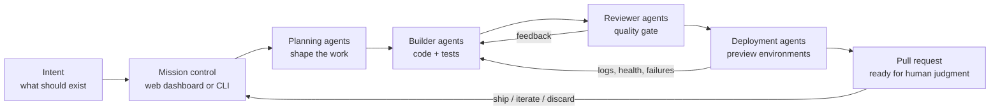
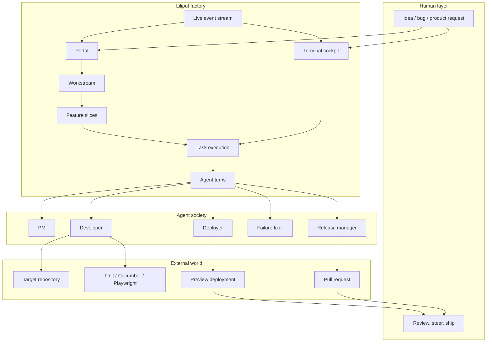
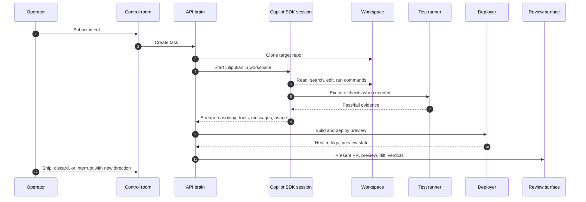
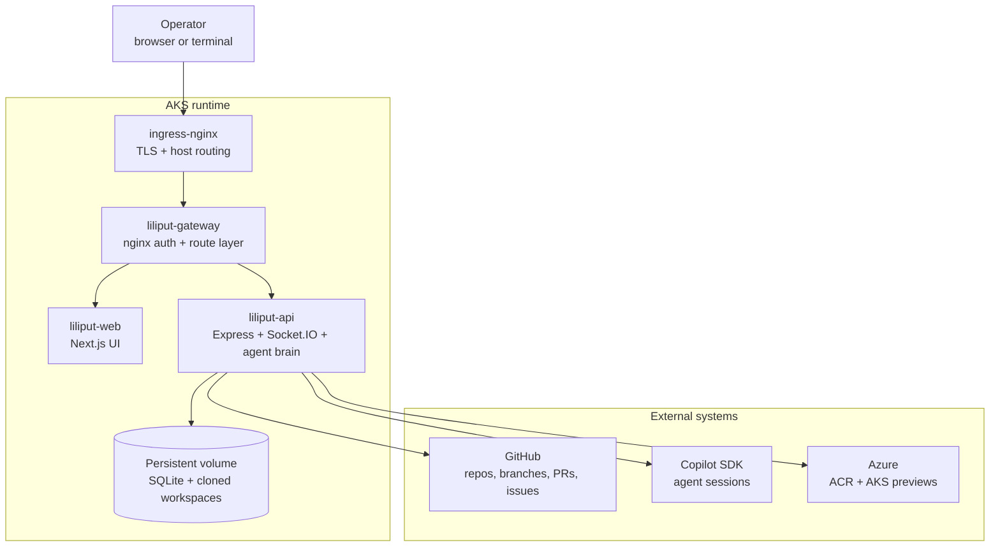
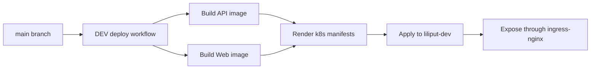

# Liliput

```text
LILIPUT // AUTONOMOUS SOFTWARE FACTORY

Tell it what should exist.
Watch a tiny engineering world organize itself.
Ship the result as tested, reviewed, running software.
```

**Liliput is an entire world for software agents.** It is not a chat box, not a
script runner, and not a thin wrapper around a code editor. It is a miniature
software development factory where agents act like a product team: they plan,
split work, clone repositories, read project rules, write code, run tests,
deploy previews, review changes, recover from failures, and prepare pull
requests for humans to approve.

A Liliputian can take a plain-English goal and move it through the same stations
a real team would use: product intent, implementation, verification, release
review, deployment, and operational feedback. The factory can run with a human
watching every move, or it can keep looping autonomously until the work is
tested and ready.


```mermaid
flowchart LR
    Intent["Intent<br/>what should exist"]
    Control["Mission control<br/>web dashboard or CLI"]
    Planner["Planning agents<br/>shape the work"]
    Builder["Builder agents<br/>code + tests"]
    Reviewer["Reviewer agents<br/>quality gate"]
    Deploy["Deployment agents<br/>preview environments"]
    PR["Pull request<br/>ready for human judgment"]

    Intent --> Control --> Planner --> Builder --> Reviewer --> Deploy --> PR
    Deploy -->|"logs, health, failures"| Builder
    Reviewer -->|"feedback"| Builder
    PR -->|"ship / iterate / discard"| Control
```

## Why it feels different

| Ordinary agent tools | Liliput |
| --- | --- |
| One prompt, one answer | A persistent task with turns, state, logs, previews, and review |
| A model edits files | A factory coordinates planning, coding, testing, deployment, and PRs |
| Hidden execution | Every tool call, event, model, token, and verdict is visible |
| Stops when code is written | Can keep testing, deploying, diagnosing, and iterating |
| Local-only context | Target repos bring their own instructions, skills, and MCP servers |

The important idea is **observable autonomy**. Liliput is allowed to work
independently, but it is never invisible. You can watch the factory floor, jump
into a running task, redirect a Liliputian mid-flight, and review exactly how the
result was produced.

## The factory floor


```mermaid
flowchart TB
    subgraph Human["Human layer"]
        Idea["Idea / bug / product request"]
        Review["Review, steer, ship"]
    end

    subgraph Factory["Liliput factory"]
        Dashboard["Portal"]
        TUI["Terminal cockpit"]
        Workstream["Workstream"]
        Feature["Feature slices"]
        Task["Task execution"]
        Turn["Agent turns"]
        Logs["Live event stream"]
    end

    subgraph Agents["Agent society"]
        PM["PM"]
        Dev["Developer"]
        RM["Release manager"]
        Fixer["Failure fixer"]
        Deployer["Deployer"]
    end

    subgraph World["External world"]
        Repo["Target repository"]
        Tests["Unit / Cucumber / Playwright"]
        Preview["Preview deployment"]
        PullRequest["Pull request"]
    end

    Idea --> Dashboard
    Idea --> TUI
    Dashboard --> Workstream --> Feature --> Task --> Turn
    TUI --> Task
    Turn --> PM
    Turn --> Dev
    Turn --> RM
    Turn --> Fixer
    Turn --> Deployer
    Dev --> Repo
    Dev --> Tests
    Deployer --> Preview
    RM --> PullRequest
    Logs --> Dashboard
    Logs --> TUI
    Preview --> Review
    PullRequest --> Review
```

## A task, from spark to ship

1. **You describe the outcome.** A feature, bug fix, migration, cleanup, or
   complete application goal.
2. **Liliput creates a task.** It captures the repo, prompt, model settings,
   reviewer settings, status, and execution history.
3. **A Liliputian enters the repo.** The agent works in an isolated clone under
   the workspace volume.
4. **The repo teaches the agent.** Project instructions, skills, and MCP servers
   are discovered from the target repository.
5. **The agent builds.** It searches, edits, runs commands, writes tests, fixes
   failures, and records every event.
6. **The factory deploys.** When the task reaches preview state, Liliput builds
   an image and creates a runnable environment.
7. **Quality gates run.** Tests, reviewer feedback, health checks, and verdicts
   decide whether to continue or present the work.
8. **You take control.** Ship it, discard it, or chat with the active task to
   redirect the next turn.


```mermaid
sequenceDiagram
    autonumber
    participant O as Operator
    participant C as Control room
    participant A as API brain
    participant S as Copilot SDK session
    participant W as Workspace
    participant T as Test runner
    participant D as Deployer
    participant R as Review surface

    O->>C: Submit intent
    C->>A: Create task
    A->>W: Clone target repo
    A->>S: Start Liliputian in workspace
    S->>W: Read, search, edit, run commands
    S->>T: Execute checks when needed
    T-->>S: Pass/fail evidence
    S-->>A: Stream reasoning, tools, messages, usage
    A->>D: Build and deploy preview
    D-->>A: Health, logs, preview state
    A->>R: Present PR, preview, diff, verdicts
    O->>C: Ship, discard, or interrupt with new direction
```

## First run for a developer

### Prerequisites

| Need | Why |
| --- | --- |
| Node.js | Runs the API and web app |
| npm | Installs API, web, and root test tooling |
| Go | Builds the terminal cockpit |
| GitHub token | Lets real tasks clone, push, open PRs, and use Copilot |
| Azure CLI + kubectl | Needed for hosted preview and deployment flows |

### Install

```powershell
# Clone the repository using your approved internal Git remote.
Set-Location Liliput

npm ci
npm --prefix src/api ci
npm --prefix src/web ci
```

### Start the local factory

```powershell
# Local-only values. Never commit real secrets.
$env:JWT_SECRET = "replace-with-a-long-local-secret"
$env:DEFAULT_ADMIN_PASSWORD = "replace-with-a-local-password"
$env:COPILOT_GITHUB_TOKEN = "github-token-for-real-agent-runs"

npm run dev:all
```

| Surface | Where |
| --- | --- |
| Landing page | Web port `3000`, path `/` |
| Dashboard | Web port `3000`, path `/dashboard` |
| API health | API port `5001`, path `/api/health` |

The first boot seeds an `admin` user. If `DEFAULT_ADMIN_PASSWORD` is present,
that value is used. If it is missing, the API generates a password and prints it
once. Existing SQLite databases keep their users, so changing the variable later
does not reset a password.

## Repository map

```text
.
|-- src/
|   |-- api/       Express API, agent engine, auth, stores, deployment logic
|   |-- web/       Next.js control room, dashboard, task views, live activity
|   `-- shared/    Shared TypeScript contracts
|-- cli/           Go terminal cockpit
|-- k8s/           AKS manifests for gateway, API, web, PVC, ingress
|-- infra/         Infrastructure templates and deployment scripts
|-- e2e/           Playwright tests
|-- tests/         Cucumber feature tests
|-- specs/         Product, FRD, architecture, and delivery documents
|-- templates/     Target-repo overlays for durable agent loops
`-- .github/
    |-- workflows/ Automation for CI, releases, and DEV deploys
    `-- skills/    Agent procedures discovered by Copilot SDK sessions
```

## Runtime architecture


```mermaid
flowchart TB
    User["Operator<br/>browser or terminal"]

    subgraph Cluster["AKS runtime"]
        Ingress["ingress-nginx<br/>TLS + host routing"]
        Gateway["liliput-gateway<br/>nginx auth + route layer"]
        Web["liliput-web<br/>Next.js UI"]
        API["liliput-api<br/>Express + Socket.IO + agent brain"]
        PVC[("Persistent volume<br/>SQLite + cloned workspaces")]
    end

    subgraph Systems["External systems"]
        Git["GitHub<br/>repos, branches, PRs, issues"]
        SDK["Copilot SDK<br/>agent sessions"]
        Azure["Azure<br/>ACR + AKS previews"]
    end

    User --> Ingress --> Gateway
    Gateway --> Web
    Gateway --> API
    API --> PVC
    API --> Git
    API --> SDK
    API --> Azure
```

Current hosted deployments use ingress-nginx in front of the in-cluster gateway.
The gateway protects dashboard, API, and Socket.IO routes, while leaving the
landing and login surfaces public. Application Gateway for Containers is not in
the current runtime path.

## The API pod is the brain

The API process owns the interesting work:

| Responsibility | Where it happens |
| --- | --- |
| Task and turn state | SQLite |
| Live event streaming | Socket.IO |
| Agent sessions | Copilot SDK, in process |
| Repo workspaces | Persistent volume under `/data/workspaces` |
| Git operations | Child processes in cloned target repos |
| Preview builds | Azure Container Registry and AKS |
| Auth | JWT session cookie plus API verification endpoint |

Because the SDK session is in process, a pod restart stops active turns. The
database and cloned workspaces survive on the persistent volume, so durable
state remains available after restart.

## CLI: the terminal cockpit

The CLI is a k9s-style control panel for the same backend.

```powershell
scoop bucket add liliput <approved-liliput-bucket>
scoop install liliput
liliput --server <approved-liliput-server> --login
```

From source:

```powershell
Set-Location cli
go build -o liliput.exe .\cmd\liliput
.\liliput.exe --server <local-api-server> --login
```

| Key | Action |
| --- | --- |
| `j` / `k`, arrows | Move |
| `Enter` | Open task |
| `n` | New task |
| `/` | Filter |
| `Tab` | Cycle task-detail panes |
| `i` | Focus chat input |
| `s` | Ship task |
| `x` | Discard task |
| `l` | Tail dev pod logs |
| `?` | Help |
| `q` | Back or quit |

CLI internals live in `cli/internal/client` for REST and Socket.IO, and
`cli/internal/ui` for Bubble Tea screens.

## Where to make changes

| Goal | Start here |
| --- | --- |
| Make the landing page more cinematic | `src/web/src/app/page.tsx` |
| Change the authenticated dashboard | `src/web/src/app/dashboard/page.tsx` |
| Add or change API routes | `src/api/src/routes/` and `src/api/src/app.ts` |
| Change agent execution | `src/api/src/engine/agent-engine.ts` |
| Change model or turn behavior | `src/api/src/engine/agent-loop.ts` |
| Change reviewer behavior | `src/api/src/engine/reviewer-loop.ts` |
| Change persistence | `src/api/src/stores/` |
| Change gateway auth or routing | `k8s/liliput.yaml` |
| Add a reusable agent procedure | `.github/skills/<skill>/SKILL.md` |
| Change the terminal cockpit | `cli/internal/ui/` |
| Change target-repo PM -> Dev -> RM overlay | `templates/liliput-flow/` |

## Commands

| Command | Purpose |
| --- | --- |
| `npm run dev:all` | Run API and Web together |
| `npm run build:all` | Build API and Web |
| `npm run test:api` | Run API Vitest suite |
| `npm run test:cucumber` | Run Cucumber features |
| `npm run test:e2e` | Run Playwright tests |
| `npm run test:all` | Run API, Cucumber, and Playwright suites |
| `npm --prefix src/api run lint` | Lint API |
| `npm --prefix src/web run lint` | Lint Web |
| `go test ./...` from `cli/` | Run CLI tests |

For isolated slices:

```powershell
npm --prefix src/api run dev
npm --prefix src/web run dev
npm --prefix src/api run build
npm --prefix src/web run build
```

## Configuration

Never commit real values. Keep them in local environment variables, Kubernetes
secrets, or GitHub Actions secrets.

| Variable | Purpose |
| --- | --- |
| `JWT_SECRET` | Signs Liliput sessions |
| `DEFAULT_ADMIN_PASSWORD` | Seeds the first admin user for a new database |
| `DB_PATH` | SQLite database path |
| `COPILOT_GITHUB_TOKEN` | Main token for GitHub and Copilot-backed work |
| `GH_TOKEN`, `GITHUB_TOKEN` | Fallback GitHub token names |
| `GITHUB_WEBHOOK_SECRET` | Enables signed webhook handling |
| `COPILOT_MODEL` | Default coding model |
| `COPILOT_REVIEWER_MODEL` | Default reviewer model |
| `ACR_NAME` | Registry used for preview images |
| `LILIPUT_PUBLIC_URL` | Public base used when generating navigation |
| `LILIPUT_NAMESPACE` | Kubernetes namespace used by the API |
| `LILIPUT_RECONCILER_ENABLED` | Enables issue and PR polling fallback |
| `AUTOPILOT_DECOMPOSE` | Enables workstream feature decomposition |

## Deployment path

DEV deployment is driven by `.github/workflows/deploy-liliput-dev.yml`.


```mermaid
flowchart LR
    Main["main branch"]
    Action["DEV deploy workflow"]
    BuildAPI["Build API image"]
    BuildWeb["Build Web image"]
    Manifest["Render k8s manifests"]
    Apply["Apply to liliput-dev"]
    Ingress["Expose through ingress-nginx"]

    Main --> Action --> BuildAPI --> Manifest
    Action --> BuildWeb --> Manifest
    Manifest --> Apply --> Ingress
```

Useful operator checks:

```powershell
kubectl -n liliput-dev get pods
kubectl -n liliput-dev logs deployment/liliput-api --tail=100
kubectl -n liliput-dev rollout status deployment/liliput-api
```

## Durable PM -> Dev -> RM loop

Liliput can install a durable agent workflow into a target repo. The state lives
in issues, labels, PRs, and timelines rather than a single chat session.

```text
pm:ready
   |
   v
dev:in-progress
   |
   v
rm:review -----> done
   |
   v
rm:changes-requested
   |
   v
dev:in-progress
```

Install the overlay into a target repository:

```powershell
bash scripts/bootstrap-liliput-flow.sh <target-repo-path> --apply-labels
```

The PM agent writes small issues with acceptance criteria, the Dev agent
implements test-first and opens PRs, and the Release Manager agent checks and
merges or bounces the work with structured feedback.

## Troubleshooting

| Symptom | Likely cause | First move |
| --- | --- | --- |
| Dashboard redirects to login | Missing or expired session | Sign in again and check `JWT_SECRET` stability |
| Login fails | Stored password does not match | Check first-boot logs or reset the local database |
| Repo list or PR creation fails | Bad GitHub token | Verify `COPILOT_GITHUB_TOKEN` or fallback token |
| Preview deployment fails | Azure, AKS, ACR, or manifest issue | Check API logs and preview namespace events |
| Web cannot reach API locally | Wrong API base | Confirm Web rewrites to API port `5001` |
| Task appears stuck after restart | Active SDK turn was interrupted | Retry or resume from persisted task state |

## The vibe

Liliput should feel like a luminous operations deck for autonomous software
creation:

- **Small agents, big outcomes.**
- **Full-stack work, not isolated code snippets.**
- **Autonomy with telemetry, not magic behind a curtain.**
- **Testing and deployment as first-class factory stations.**
- **Human judgment at the gates, agent persistence in the loops.**

## License

ISC. See the repository license file.
