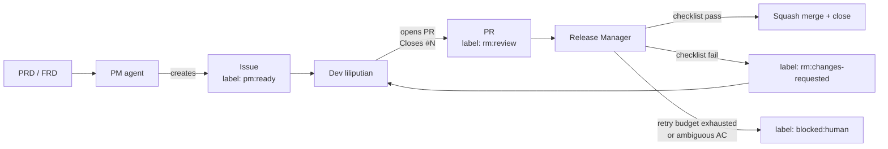

# 🏰 Liliput PM → Dev → RM flow

This repository participates in the **Liliput agent loop**. Three roles, one
GitHub Issue per unit of work, deterministic handoffs via labels.



## Roles

| Role | Reads | Writes | Never does |
|---|---|---|---|
| **PM agent** | PRD, FRDs, backlog | Issues w/ AC + DoD | Implement code |
| **Dev liliputian** | Issue body, code | Branch + PR + tests | Re-interpret AC |
| **Release Manager** | PR, CI, Issue | Review comments, labels, merge | Edit code |

## Label state machine

| Label | Set by | Meaning |
|---|---|---|
| `pm:ready` | PM | Issue is fully specified and unclaimed. |
| `dev:in-progress` | Dev | Dev picked up the issue (and ideally pushed a branch). |
| `rm:review` | Dev (when opening PR) | PR ready for RM. |
| `rm:changes-requested` | RM | Bounced back to dev. See latest RM comment. |
| `dev:rebase-needed` | RM | Merge conflict / stale base. |
| `blocked:human` | RM (or any agent) | Auto-loop cannot proceed. |
| `done` | RM | Issue closed via merged PR. |

## Definition of "small enough"

The PM agent **must** size each issue as `S` or `M`. `L` is rejected: split it.
A rough guide:

- **S** — one file or a few lines, one new test, < ~50 LoC diff.
- **M** — a handful of files, focused scope, a few tests, < ~250 LoC diff.

## How "details are not lost"

1. The **Issue is the contract**. AC are Gherkin Given/When/Then.
2. The **PR mirrors the AC** checkbox-for-checkbox.
3. The **RM checklist** (`.github/liliput/rm-checklist.md`) is deterministic.
4. GitHub's **issue timeline** is the durable audit log across agent sessions.
5. **Retry budget** prevents infinite dev↔RM ping-pong.

## Files in this overlay

- `.github/ISSUE_TEMPLATE/liliput-task.yml` — PM issue form.
- `.github/pull_request_template.md` — Dev PR template.
- `.github/liliput/labels.yml` — Label definitions (source of truth).
- `.github/liliput/rm-checklist.md` — RM deterministic checklist.
- `.github/workflows/liliput-labels.yml` — Syncs labels on push to main.

To re-apply this overlay (e.g. after editing), run from the repo root:

```bash
bash scripts/bootstrap-liliput-flow.sh .
```
